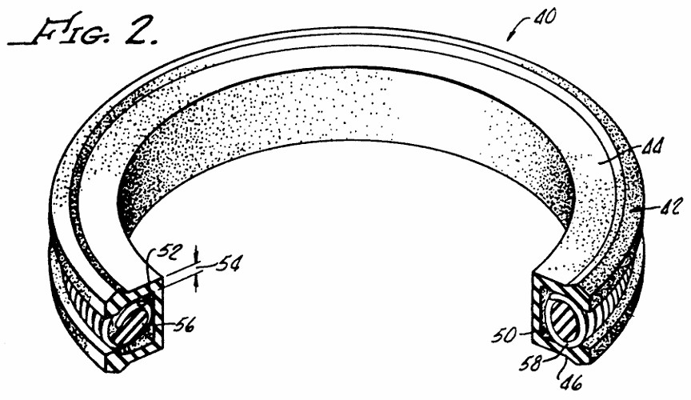

# A1 – Create and Engineering Portfolio

## Objective
The Objective is to successfully create an online portfolio that I can upload all of my engineering projects to.

## Analyze
#### Task A: Portfolio analysis
###### Portfolio 1: https://3-d-portfolio-lilac-xi.vercel.app/#work

This online portfolio is excellently organized, making it easy for users to navigate and view the portfolio owner’s skills, projects, and previous experience as they scroll through the page. The short animations used to introduce the owner’s information add a polished and engaging element to the design, demonstrating a level of effort and attention to detail that is often lacking in online portfolios. Additionally, the navigation bar in the top-right corner allows users to quickly access whichever section they are interested in. Another feature I particularly like is the way the projects are presented. When users click the small spaceship icon in the top-left corner of a project, the project opens and runs in a new tab. Clicking the GitHub logo in the top-right corner takes users to the project’s GitHub repository, where they can see how the project was created. Although the projects do not explicitly explain the reasoning behind the design decisions, the information is organized in a way that may allow some users to understand why the project was developed as it was.

###### Portfolio 2: https://javiersanchezramirez.github.io/

This online portfolio is similar to the first portfolio analyzed in that it allows users to scroll through the entire page while also providing a navigation bar at the top to quickly jump between different sections. One aspect I particularly like is that pictures of the portfolio owner’s projects are among the first things presented to the viewer. However, when you hover over the project images, they only provide a brief one- or two-sentence description of each project. As a result, there is little opportunity to learn more about the projects, understand the decision-making process behind them, or examine how they were designed and developed beyond what can be seen in the images. Overall, the portfolio maintains a fairly professional tone and presentation.

#### Task B: Product Analysis

###### Patent Chosen: US5265890A
###### Inventor: Peter J. Balsells

The patent chosen was a seal with a spring energizer. I chose this patent because it was related to the undergraduate research participated in over the summer of 2026. The primary purpose of this seal is to seal axially between two moving surfaces by maintaining a constant pressure via the energy from the spring.

## Decide

## Communicate

