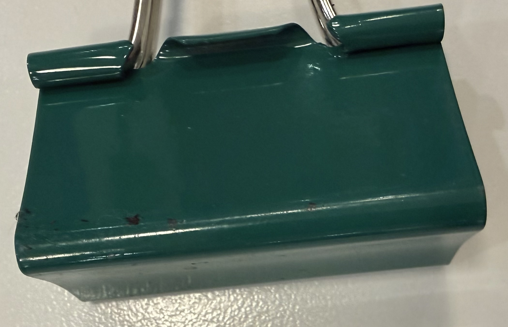
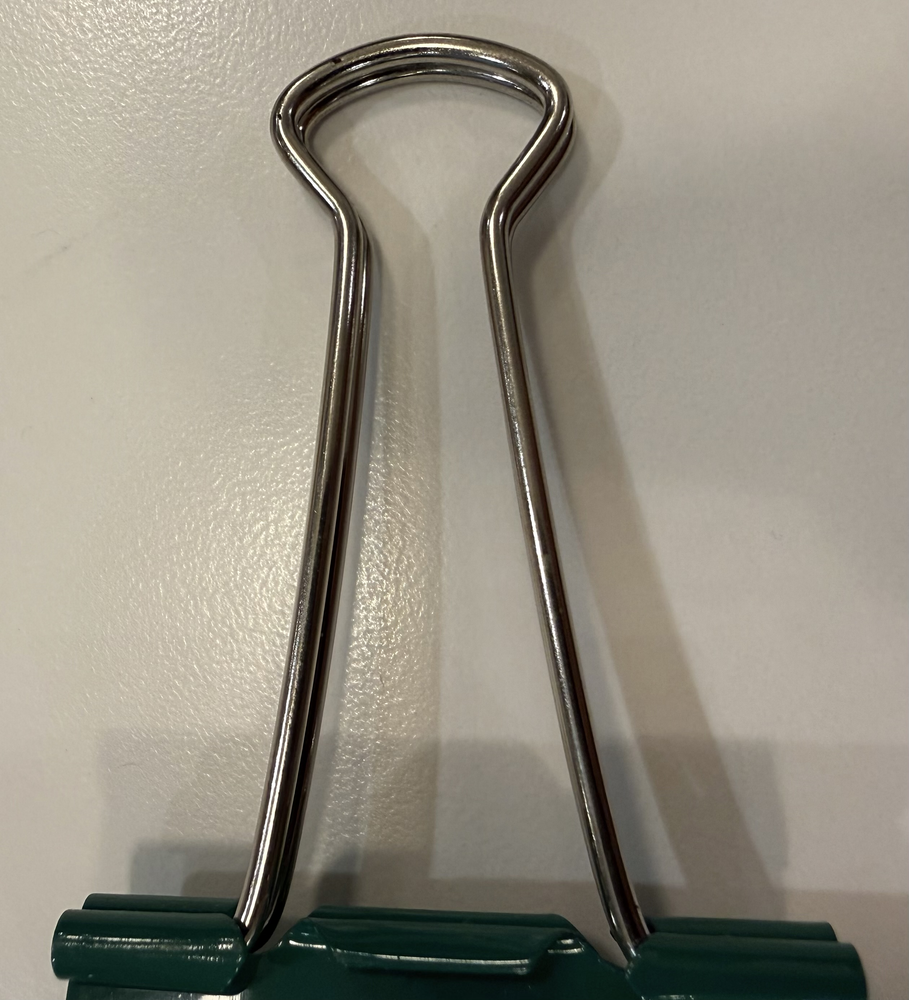

# A1 – Create and Engineering Portfolio

## Objective
The Objective is to successfully create an online portfolio that I can upload all of my engineering projects to.

## Analyze
#### Task A: Portfolio analysis
###### Portfolio 1: [Link](https://3-d-portfolio-lilac-xi.vercel.app/#work)

This online portfolio is excellently organized, making it easy for users to navigate and view the portfolio owner’s skills, projects, and previous experience as they scroll through the page. The short animations used to introduce the owner’s information add a polished and engaging element to the design, demonstrating a level of effort and attention to detail that is often lacking in online portfolios. Additionally, the navigation bar in the top-right corner allows users to quickly access whichever section they are interested in. Another feature I particularly like is the way the projects are presented. When users click the small spaceship icon in the top-left corner of a project, the project opens and runs in a new tab. Clicking the GitHub logo in the top-right corner takes users to the project’s GitHub repository, where they can see how the project was created. Although the projects do not explicitly explain the reasoning behind the design decisions, the information is organized in a way that may allow some users to understand why the project was developed as it was.

###### Portfolio 2: [Link](https://javiersanchezramirez.github.io/)

This online portfolio is similar to the first portfolio analyzed in that it allows users to scroll through the entire page while also providing a navigation bar at the top to quickly jump between different sections. One aspect I particularly like is that pictures of the portfolio owner’s projects are among the first things presented to the viewer. However, when you hover over the project images, they only provide a brief one- or two-sentence description of each project. As a result, there is little opportunity to learn more about the projects, understand the decision-making process behind them, or examine how they were designed and developed beyond what can be seen in the images. Overall, the portfolio maintains a fairly professional tone and presentation.

#### Task B: Product Analysis

###### Patent Chosen: US7120969B2
###### Inventor: David R. Carls

The patent chosen was for a binder clip. The primary purpose of this product is to apply parallel and oppositely facing forces to clamp paper together. The governing model for this is the moment equation.

  <b>Ms = Fd;</b>

M = Moment

F = Force

d = Distance

For this model to work, it must be assumed that the body of the binder clip remains within its elastic range so that it can return to its original shape. The metal finger grips extend from the back of the clip and provide a longer lever arm, making it easier to open and close the clamp. The grips can also rotate so that they can be positioned parallel to the paper, similar to how the handle of a nail clipper can be repositioned for use.

The image above shows the metal clamp component. This is the part of the binder clip that bends when the clip is opened and then uses its elastic rebound to apply a clamping force and hold the paper together. The clip has a roughly triangular tubular shape, with the opening of the clamp forming one corner. The clamp opens and closes because the side opposite the opening bends when force is applied.

The above picture is of the metal finger handles in parallel in the extended forward position they are meant to be in when clamped to the paper. The handles are attached to the clamp and can rotate around their attachment points. This allows the handles to be positioned along the sides of the triangular clip body, making them easier to grip. When the handles are squeezed together, they apply a force to the sides of the clip body, causing the clamp to bend and open. The length of the handles also provides a lever arm that allows the user to open the clamp with less force.

###### Alternatives to a binger clamp
* A paper clip can more easily be used when dealing with smaller amounts of paper.
* A hair pin could be used in a similar manner as a paper clip.
* A stapler and staple could staple paper together and permanently bunch them together.

###### Design Decisions
The original engineer designed the bending side of the triangular tube component to have a slight curve inward. This is likely a decision that improved the elastic rebound of the clip.

## Decide
### Homepage Identity
The primary purpose of an engineering portfolio is to present projects clearly for quick review and analysis. Because potential employers typically skim portfolios, the homepage highlights essential details—such as my name and a preview of final project results—before visitors navigate the side menu. Clicking a project thumbnail takes the reader directly to its detailed documentation, while the homepage also provides a brief overview of the site's navigation.

## Communicate

