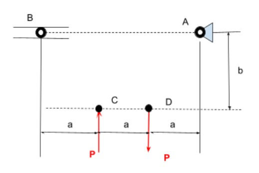

# A2 – Truss Stress Analysis

## Objective
My objective is to design and 3D model a truss that can support the load within the provided scenario.

  

## Analyze

## Decide
_Which geometry did you select, and why? This is your first open design choice in the course — defend it._

## Communicate

