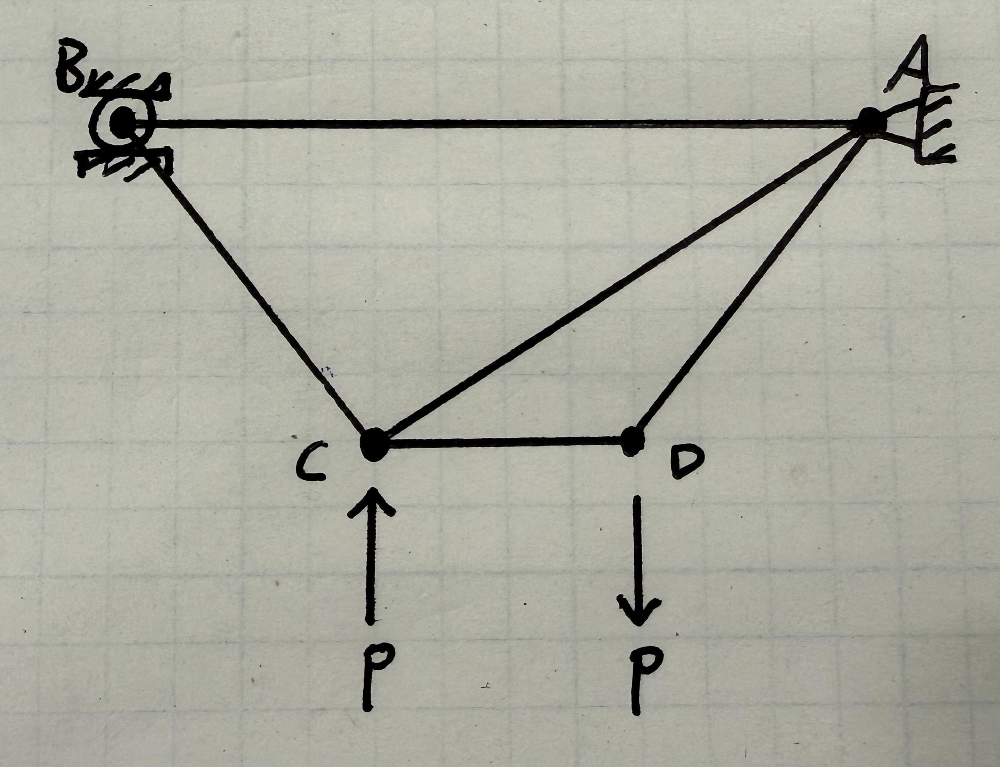

# A2 – Truss Stress Analysis

## Objective

My objective is to design and 3D model a truss system out of A36 steel that can support the load within the provided scenario.

  

  
<b>Ys = 250 MPa</b>

  
<b>P = 20 kN</b>

  
<b>a = 0.3 m</b>

  
<b>b = 0.3 m</b>

## Design Process

The two things I immediately thought of when I was deciding how to design my truss system was stability and triangulation. I know that triangles are one of the strongest planar structures and I know the formula that for how many joints should be in a truss for it to be statically determinate. Utilizing this formula, I concluded that I should 5 members in my system.

  
2⋅(# of joints) = 3 + (# of members)

  
-2(4) = 3 + x

  
x = 5

  

## External Forces

  
<b>ΣFy</b> = 0 = Ay + By − P + P

  

    Ay = −By
  

  
<b>ΣFx</b> = 0 = Ax

  

    Ax = 0
  

  
<b>ΣMA</b> = 0 = +P(a) − P(2a) + By(3a)

  
By(3a) = P(a − 2a)

  
By(3a) = P(−a)

  

    By = −P(1/3)
  

## Decide
_Which geometry did you select, and why? This is your first open design choice in the course — defend it._

## Communicate

