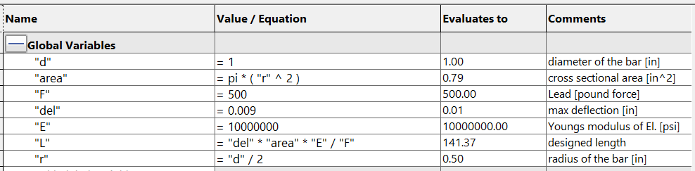
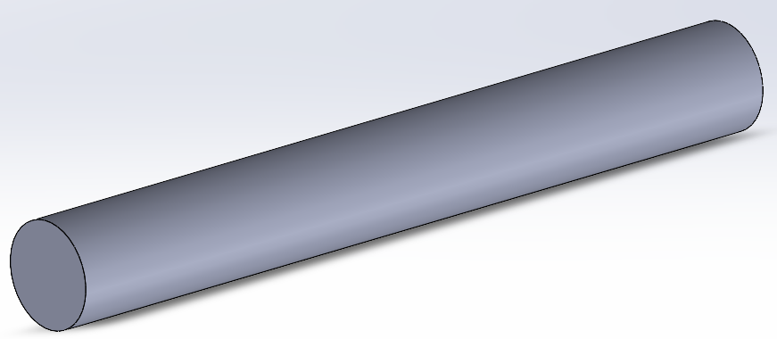
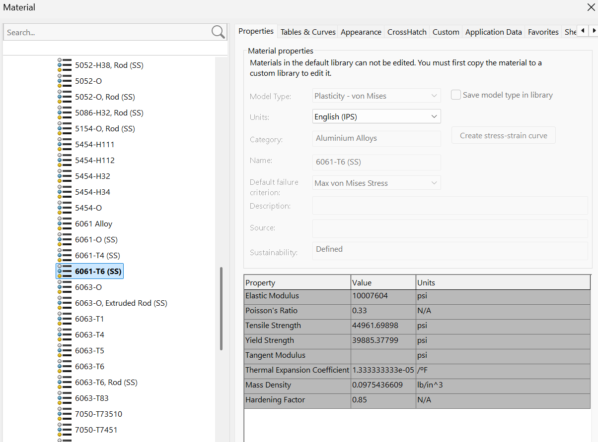
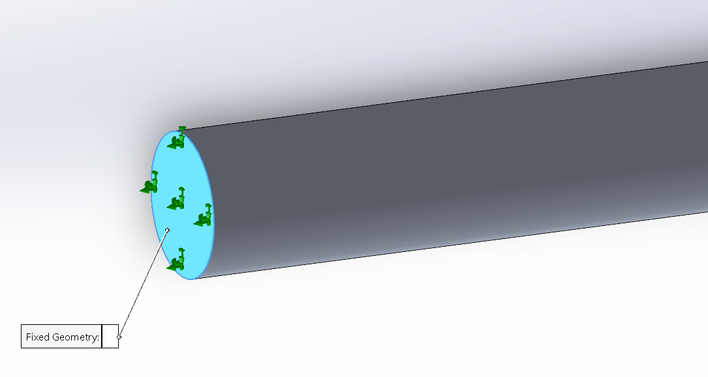
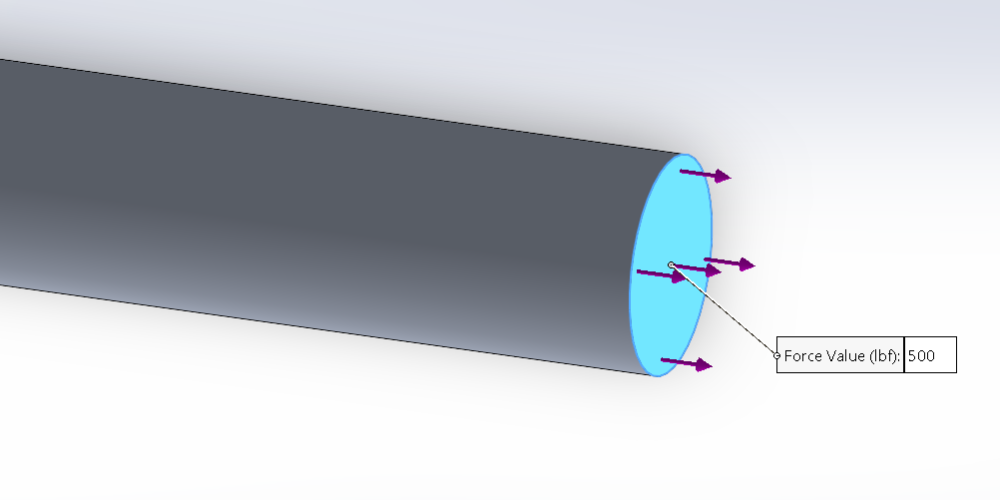
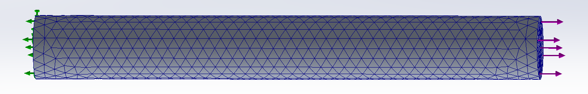
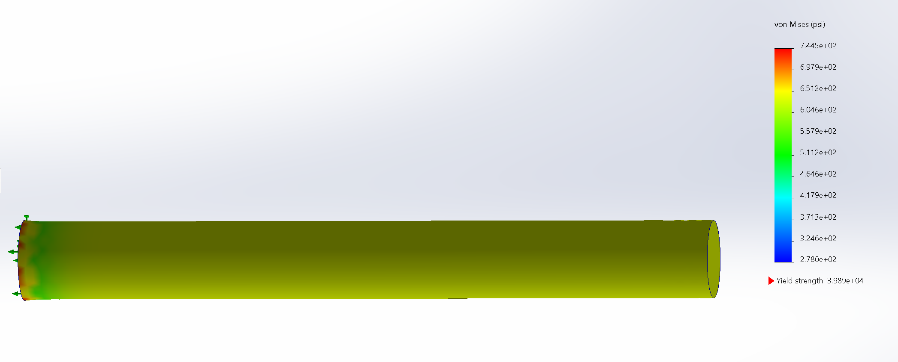
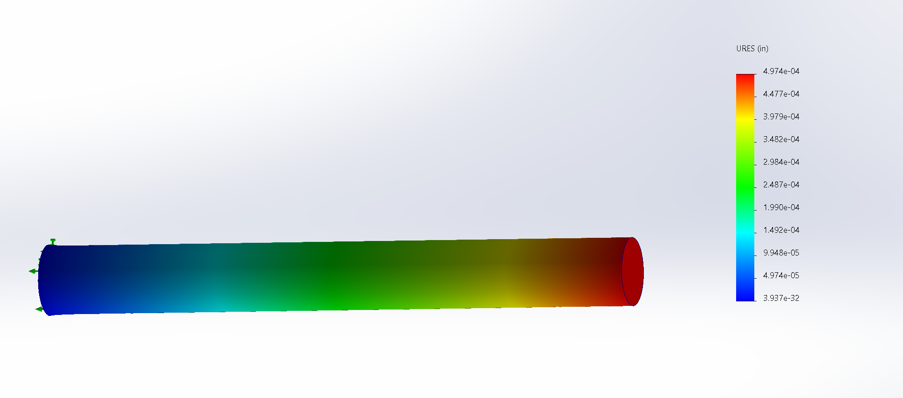

# A3 – Parametric Modeling and FEA

## Objective
The purpose of this assignment is to parametrically design a bar with a circular cross section that is subjected to an axial load between 300 lbf and 500 lbf such that the bar's maximum axial deflection does not exceed 0.009 inches. The bar is to be designed from aluminum with a Young's modulus in the range of 8.5–11.5 × 10⁶ psi. Then we are supposed to run an FEA simulation on the CAD model we created and afterwards reflect on the differences between the calculations used to design the model and what the FEA simulation shows.

## Analyze

### Setting Up Equations

I used the stress and strain equations and Hook's Law to algebraically solve for the variable length.   

<strong>Stress</strong>

<strong>σ = F/A</strong>

<strong>F</strong> = Applied Axial Force

<strong>A</strong> = Cross-sectional area

<strong>σ</strong> = stress

<strong>Strain</strong>

<strong>ε = δ/L</strong>

<strong>L</strong> = Length

<strong>δ</strong> = Deflection

<strong>ε</strong> = Strain

<strong>Hooke's Law</strong>

<strong>σ = Eε</strong>

<strong>E</strong> = Young's modulus of elasticity

<strong>Algebra</strong>

Insert the stress and strain equations into Hooke's Law

F/A = E(δ/L)

<table border="3" cellpadding="10"><tr><td><strong>δ = FL/(AE)</strong></td></tr></table>

## Modeling

### Creating the CAD Model
I chose to use an initial diameter of 1 inch and an elasticity of 10 × 10⁶ psi. I wanted to design a bar that bends more easily and I thought that a bar that bends easily would need a wide diameter. My next step was to set up the global variables on SolidWorks (my CAD software of choice) to automatically define the measurements I have calculated.

  

Below is a picture of the finished model before I begin the FEA.

  

### FEA
When choosing the parameters for the FEA simulation, I chose to create the bar out of 6061-T6 (SS) aluminum because it had the closest modulus of elasticity to the one I chose when designing the bar. Then I chose which side of the bar would be fixed to the wall and which side would be loaded.

  

  

  

Next I added a mesh and I chose the option closest to the middle between gritty and fine. The Mesh breaks the surfaces into smaller parts for the FEA simulation to analyze.

  

The next step was to run the FEA and analyze the resulting Von Mises stress map to ensure that the maximum stress on the bar does not exceed the strength of the aluminum.

  

The Von Mises stress map showed the maximum stress was 0.07445 psi, which was lower than the yield strength of the aluminum was 39890 psi concluding the project with a factor of safety of 53.6 (factor of safety calculation below).

Factor of Safety <strong>=</strong> Yield Strength &divide; Max Stress <strong>=</strong> 39890 psi &divide; 744.4 psi <strong>=</strong> <strong>53.6</strong>

Below is the simulated deflection.

  

## Reflection
There was a significant difference between the maximum deflection within the simulation and what I believed it should have been from my hand calculation. I solved for the length based on the given maximum deflection and the diameter I chose.

(Simulated Deflection) <strong>&delta;</strong>S = 0.0004974 in

(Deflection from Calculations) <strong>&delta;</strong>M = 0.009 in

<strong>&delta;</strong>M &minus; <strong>&delta;</strong>S =

0.009 in &minus; 0.0004974 in =

<table style="border: 4px solid black;" cellpadding="10"><tr><td><strong>0.0085026 in</strong></td></tr></table>

A possible reason for a difference in the calculations is that the maximum deflection of 0.009 inches rounded up to 0.01 inches in the global variables table of SolidWorks. Another reason may be that the elasticity in the global variables section was exactly 10 × 10⁶ psi while the elasticity of 6061-T6 (SS) aluminum was 7604 psi higher than that.    

