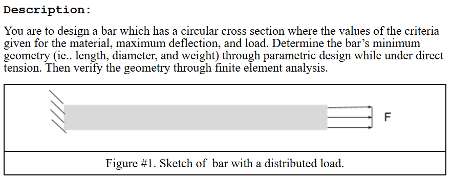

# A3 – Parametric and FEA

## Objective
The purpose of this assignment is to parametrically design a bar with a circular cross section that is subjected to an axial load between 300 lbf and 500 lbf such that the bar's maximum axial deflection does not exceed 0.009 inches. The bar is to be designed from aluminum with a Young's modulus in the range of 8.5–11.5 × 10⁶ psi. Then we are supposed to run an FEA simulation on the CAD model we created and afterwards reflect on the differences between the calculations used to design the model and what the FEA simulation shows.

  

## Analyze
### initial decisions
I chose to use an initial diameter of 1 inch and an elasticity of 8.5 × 10⁶ psi. I wanted to design a bar that bends more easily and I thought that a bar that bends easily would need a girthy diameter. My next step was to set up the global variables on SolidWorks (my CAD software of choice) to keep track of my variables.

  

I set the length equal to 1 inch for now as I have not yet solved for it.

### Set up

## Decide

## Communicate

