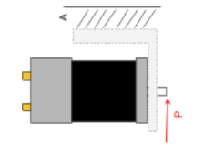
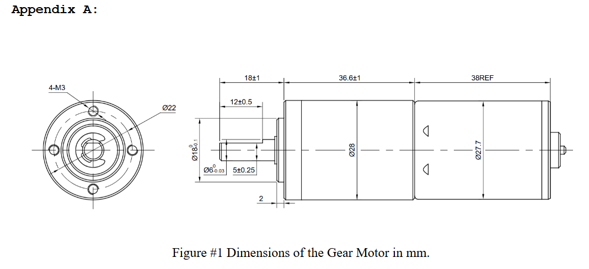
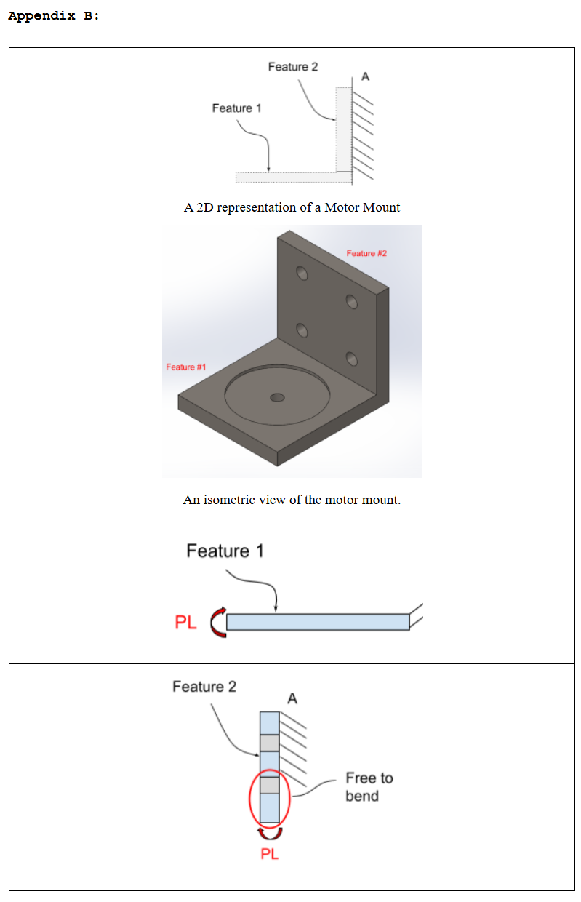
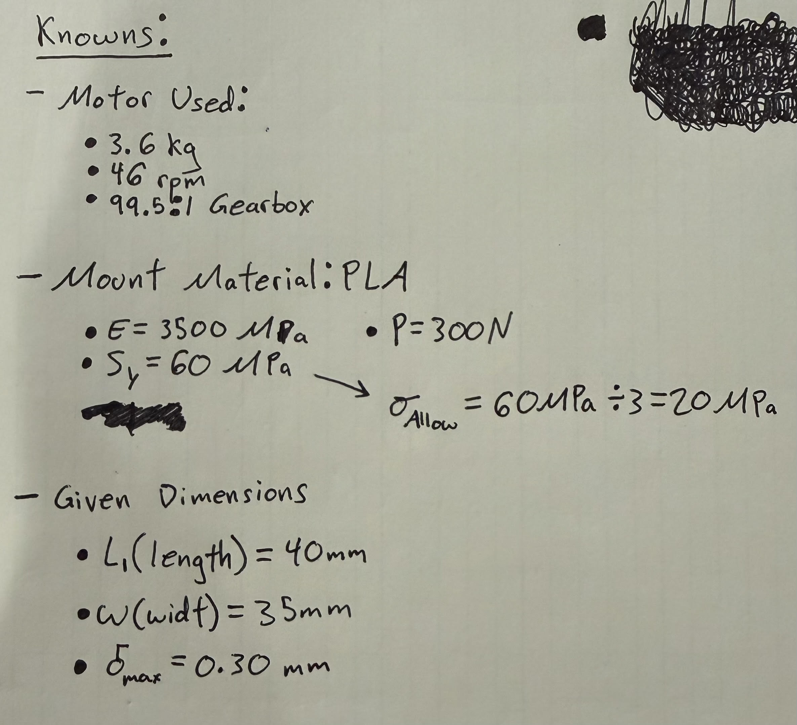
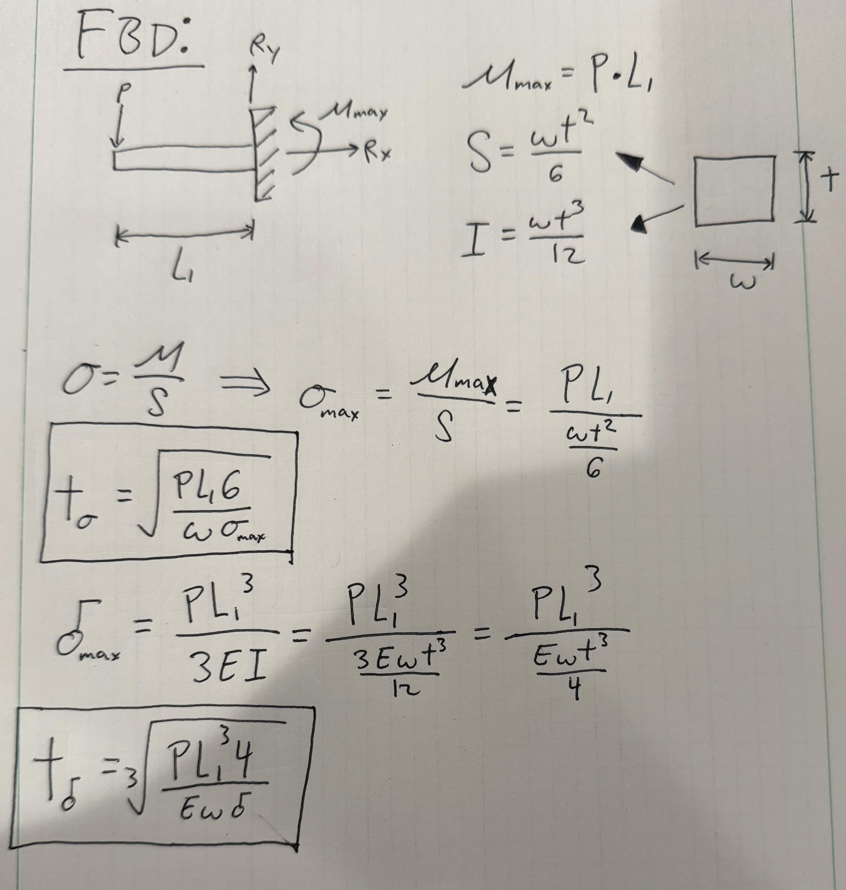
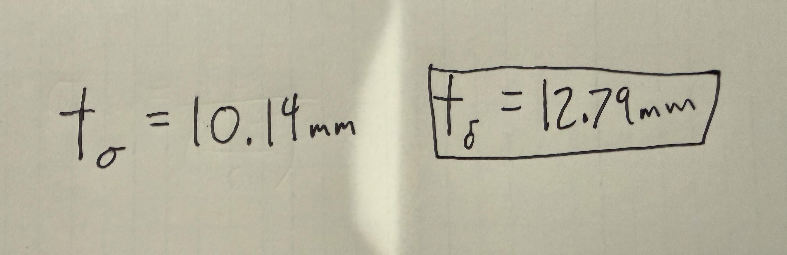
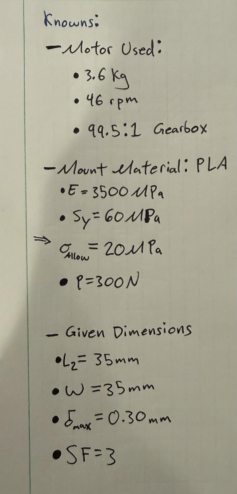
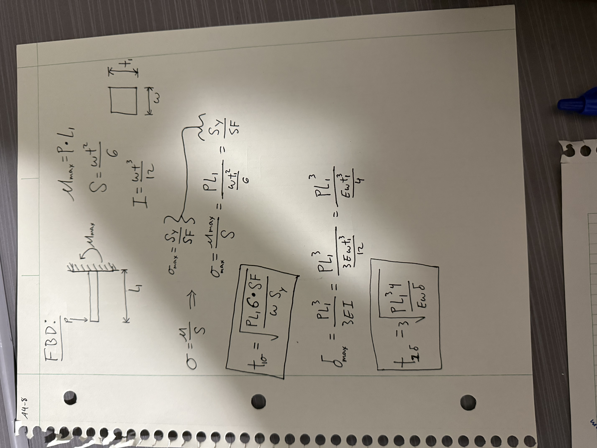
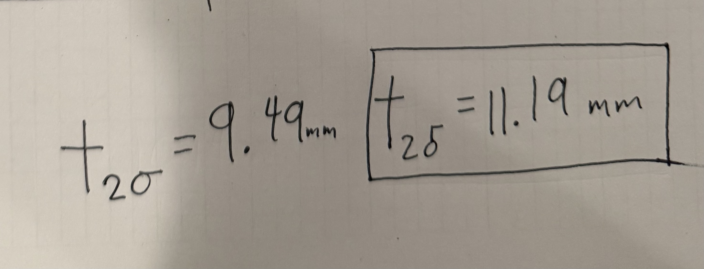
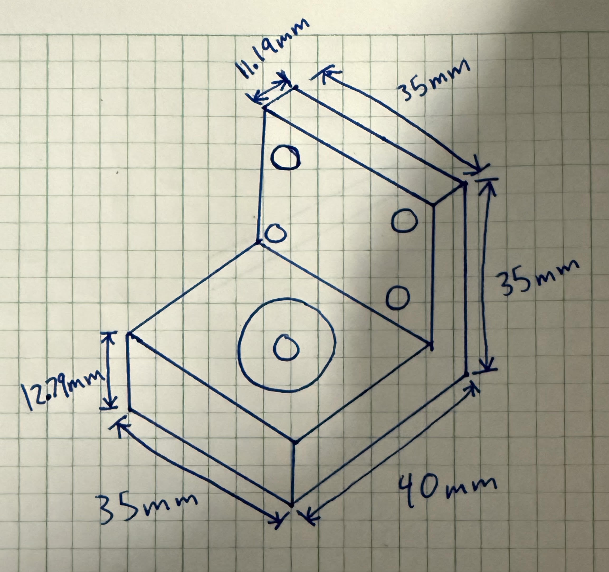

# A4 – [Topic]

## Objective
Design a motor mount using the (Brushed 24V DC Gear Motor 3.6Kg.cm/46RPM w/ 99.5:1 Planetary Gearbox) HERE which attaches to the rigid wall A. For both features, first design for yield strength and then design for a maximum deflection of .30 mm at the free end. You may select ABS, PETG,  or PLA as a motor mount material.  When designing the motor mount take into account a safety factor of 3 and neglect the weight of the motor. For steps 1 and 2 draw a FBD of the forces and a concept of your design. Research the design of different motor mounts and place the links in an appendix on your page. Make justifiable approximations in your design to simplify your analysis. (ie. use the beam calculations) Follow Appendix B for the initial approach to set up the design analysis.

  

Below is the motor dimensions and general concept of the type of mount that is expected.

  

  

    

## Hand Design

PLA was selected as the motor mount material because, among PLA, PETG, and ABS, it has the highest modulus of elasticity and among the highest yield strength, with a yield strength (Sᵧ) of approximately 60 MPa and an elastic modulus (E) of approximately 3,500 MPa. A higher modulus of elasticity means PLA deflects less under a given load than PETG or ABS, so it more easily satisfies the 0.30 mm maximum deflection requirement without requiring a larger cross-section. Combined with its high yield strength, PLA also satisfies the factor of safety of 3 strength requirement with a smaller, lighter design than the other two materials would allow, simplifying the overall analysis and geometry.

### Feature 1

  

    

The only unknown was the thickness of the plate "t"

Below is the free body diagram and the symbolic equations and the work to find them. I boxed the two values of thickness "t" that I was looking for and then accidentally boxed the Maximum moment.

I did not solve for the reaction forces because I am assuming the connection to the wall is strong enough regaurdless of the force exerted.

I calculated two formulas for the thickness based on the yield strength of PLA and the maximum deflection because they are two independent limiting factors. I will go with whichever required thickness is higher to ensure no mechanical failures, since the smaller of the two thicknesses would satisfy one requirement but fail to satisfy the other.

  

    

Below I are the numerical values of thickness I found by plugging the numbers into a calculator.

  

    

The limiting factor is deflection because the thickness based upon the maximum deflection is the highest of the two thicknesses calculated. This means I will be using t=12.79mm.

### Feature 2

  

  

Again, I did not solve for the reaction forces or the reaction moment because I am assuming the connection to the wall is strong enough regardless of the force exerted.

Again, I calculated two formulas for the thickness based on the yield strength of PLA and the maximum deflection because they are two independent limiting factors. I will go with whichever required thickness is higher to ensure no mechanical failures, since the smaller of the two thicknesses would satisfy one requirement but fail to satisfy the other.

  

 

Below I are the numerical values of thickness I found by plugging the numbers into a calculator.

  

 

The limiting factor is deflection because the thickness based upon the maximum deflection is the highest of the two thicknesses calculated. This means I will be using t=11.9mm.

### Isometric Drawing

Below is an Isometric sketch I of the design that I drew by hand

  

 

## CAD Design

I am parametrically modelling all the dimensions

  

 

