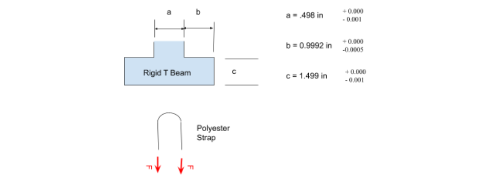
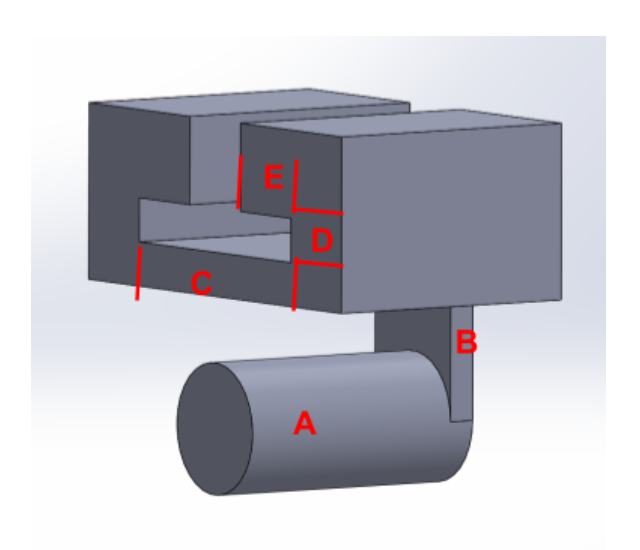
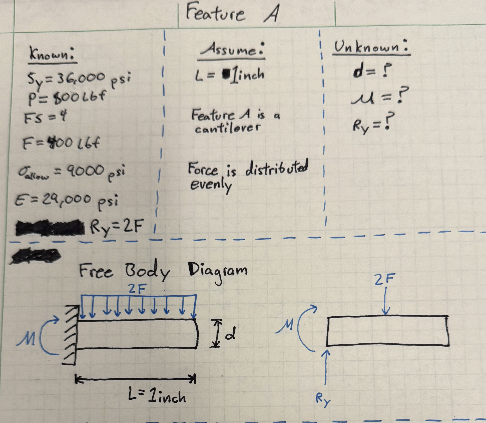
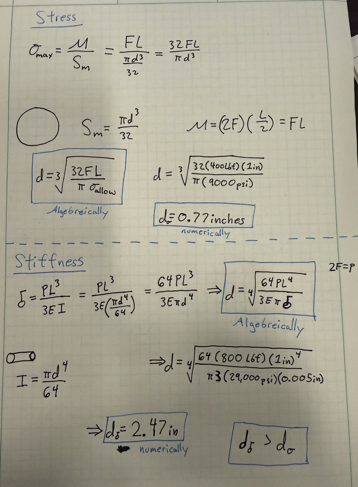
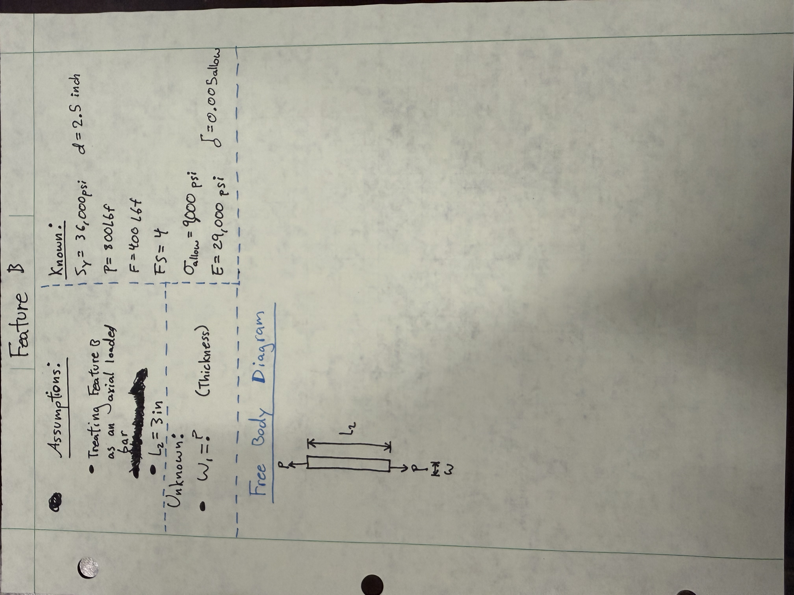
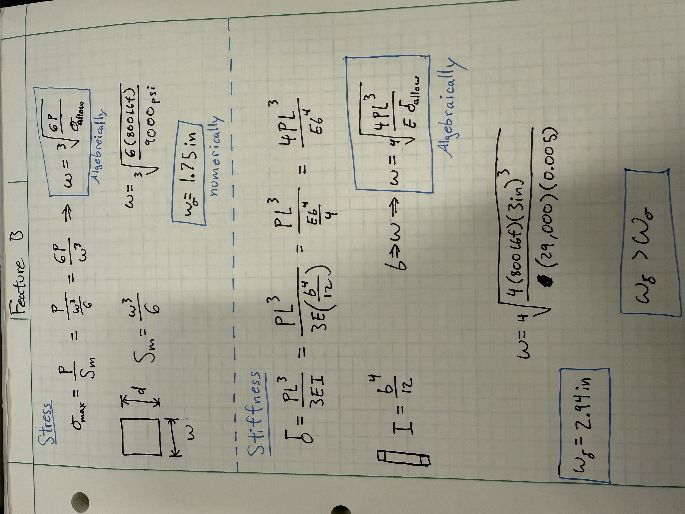

# A5 – Bracket Design

## Objective
Detail design a bracket, using the concept design in Appendix B, to hold a horizontal force applied symmetrically by a strap outline in resource #1. The bracket’s dimensions are designed with different fit classes. Each dimension of the T beam is part of the fit:

“a” intention for use where accuracy is not essential
“b” is about the closest fits that can be expected to run freely
“c” is where accurate location and minimum play is desired

Design using a safety factor of 4 and applied load in between 500 lbf < F < 800 lbf. Choose one of three metals, aluminum 6061 T6, Steel (ASTM A36), or Titanium (Ti-6Al-V4). Furthermore, state assumptions and approximations about the design in order to use fundamental strength of materials analysis. For example, use the proper stress analysis and deflection analysis where appropriate. Assume no failure due to direct shear stress. 

  

## Design Work

### Initial Approach

I have chosen to design the bracket to withstand a load of 800 lbf and to be made out of Steel (ASTM A36) because the properties are already in SolidWorks and cost is not a constraint. Below is a concept design and how it will be sectioned into features that can more easily be optimized.

  

I will be going in the order that the force reaches each part so that there is no backtracking as I analyze the features. But first, here are the constants that we know that are known and apply to all features

Sy = 36,000 psi

FS = 4

P = 800 lbf

F = 400 lbf

&sigma;allow = Sy / FS = 9,000 psi

E = 29,000 psi

&delta;max = 0.005 inches

### Feature A

The main objective for optimizing feature "A" is finding diameter after I assumed the length of "A" was 1 inch. I needed to find the moment and reaction force (Ry), but these were very simple, because there is only one vertical force other than Ry, the two forces are equal, but in opposite directions. 

  

  

After calculating the required diameter based off of stress and based off of deflection, the diameter based off of deflection was greater. This means that the diameter used will be the required diameter from deflection. However, because I need to sketch the design by hand, I will round the diameter to 2.5 inches.

### Feature B

The main objective for optimizing feature "b" was finding the thickness of the feature after assuming the length was 3 inches. I assumed 3 inches because it needed to be longer than the diameter of feature "A" and so I rounded to the next whole number. The base distance is equal to the diameter of feature "A." because it would be much harder to sketch otherwise. 

  

  

When solving for Thickness based off of deflection I accidentally inserted the inertia equation with "b" instead of "w" so I then set b=w. After calculating the required thickness based off of stress and based off of deflection, the thickness based off of deflection was greater. This means that the thickness used will be the required thickness from deflection. However, because I need to sketch the design by hand, I will round the thickness to 3.0 inches.

### Feature C

## Decide

## Communicate

