# A6 – Bracket Drawings

## Objective
The documentation’s intent is to capture your work and learning process from the time you read through the assignment all the way until you turn in your work. Your work may include but not limited to your thoughts, your insights, your mistakes, your drawings, your calculations etc. Document the process which includes many pictures with an overview of images. Make sure to post a picture of the parametric table in CAD. Detail any mistakes throughout the process. Actual time it took from start to finish. Have a Lessons Learned section

## CAD Design
I have decided to parametrically model the bracket in SolidWorks based off of the stiffness calculations because the stiffness calculations required greater lengths and volumes to maintain parameters than the stress calculations required.

### Feature A

I began by putting the initial known values into the global variables chart of SolidWorks. Then I will added the equation for feature "A" before I move onto creating that feature.

  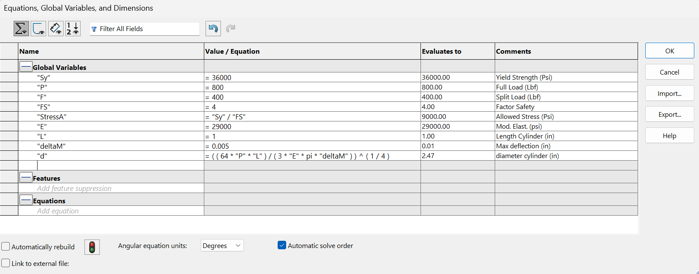

Below is feature 1 modeled

  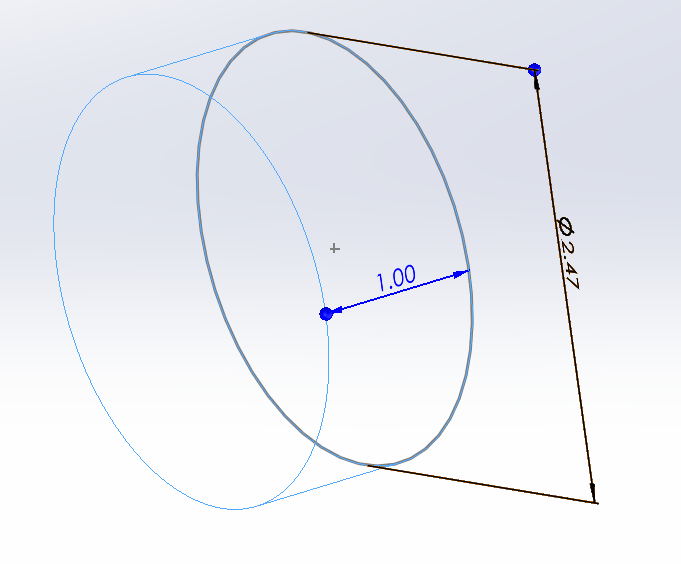

### Feature B

Below are the added equations for feature B, then the modelled feature B. 

When entering the equations for feature B, I noticed that the parametrically modelled width was not equal to the width I calculated by hand. This is because I calculated the incorrect width by hand when I plugged in the numbers for my stiffness calculations of feature B. The good news is that my algebraic equations were still correct and parametrically modeling my bracket based upon the algebraic answers will still give me the dimensions I should I have calculated if I had not made mistakes with the arithmetic.

  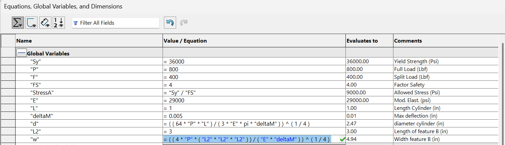

  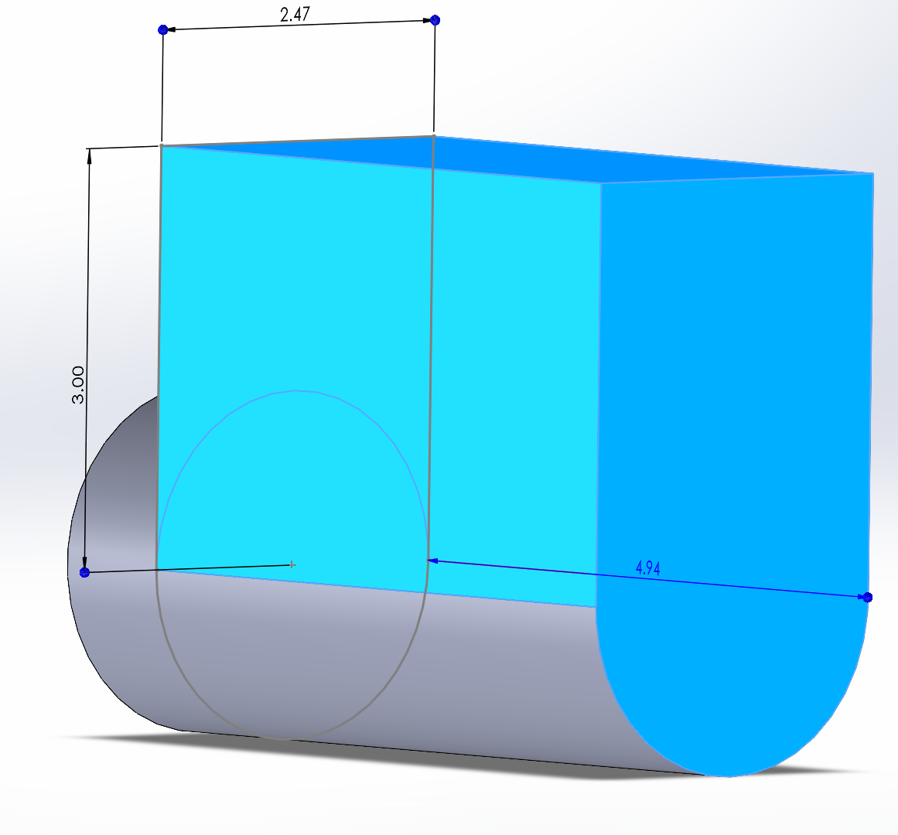

### Feature C

Below are the inserted equations for feature C, and then the modelled feature C.

Upon entering the equation for height length of feature C, I noticed an algebraic mistake with my hand calculations for "h" of feature C where "Lbab" should have been cubed and the denominator inside the cube root should have had a coefficient of 4. Having noticed this problem and fixing it within the parametric equation will ensure this problem does not spread and effect the design of the next features.

  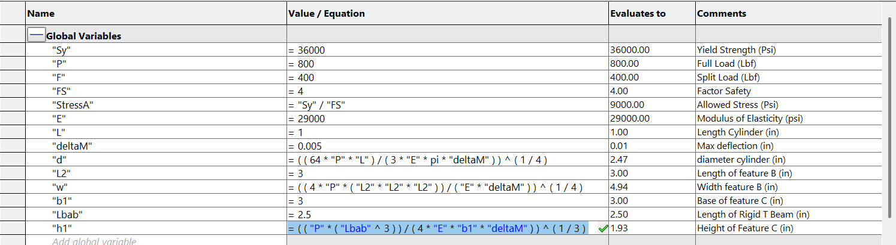

  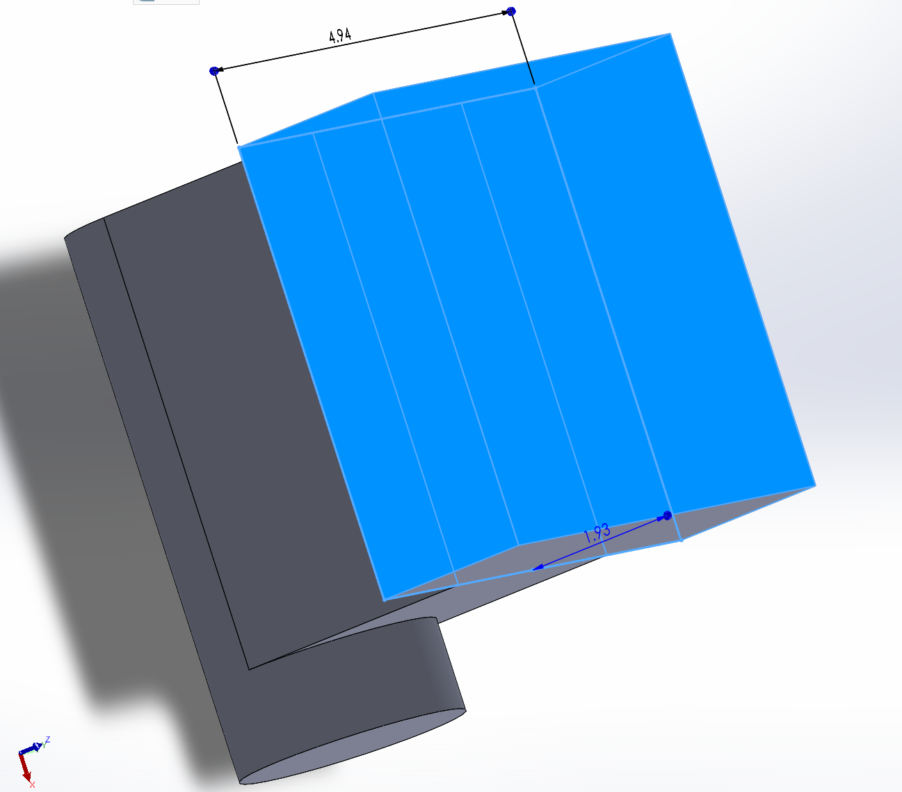

### Feature D

Below are the inserted equations for the two D features, and then the modelled D features.

I made 1 symbolic mistake when calculating the thickness of the D features by hand. I accidentally denoted the force "F" by using "P" while F is meant to be half of load "P". Also, in the arithmetic I still used the correct number for force "F" on paper but plugged the equations into the calculator wrong. I fixed this in the parametric equation by using "F" instead of "P" which will ensure the mistake is fixed and does not carry over into the future feature references to this dimension.

  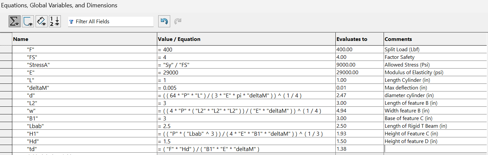

  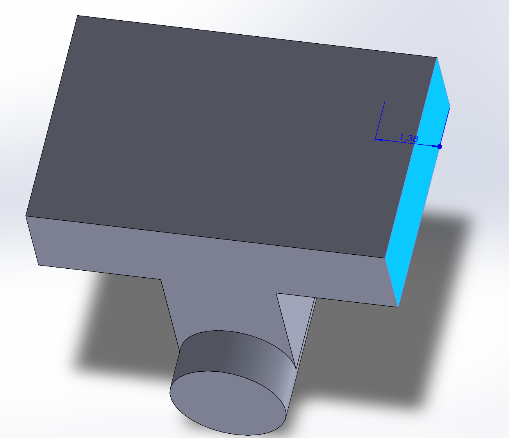

  

  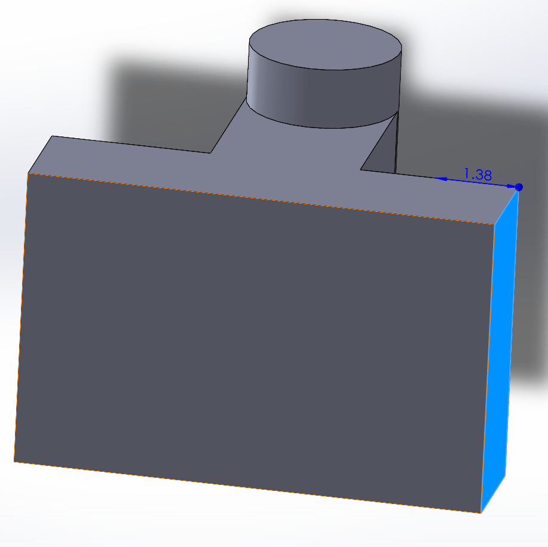

  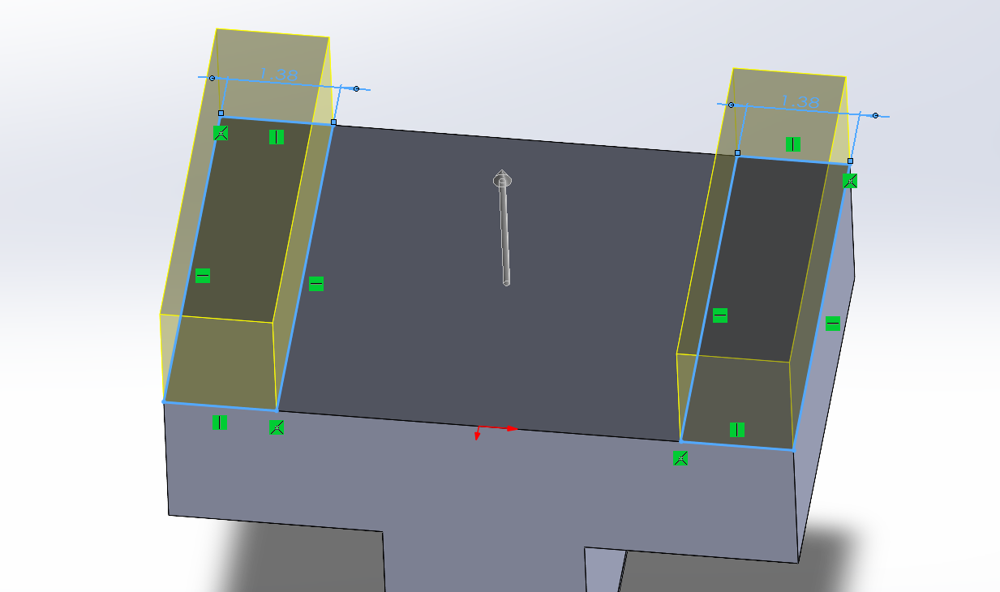

### Feature F

Below are the inserted equations for the two F features, and then the modelled F features.

The parametric equation for the thickness of the F features was different than the hand calculated thickness because this feature references the thickness of the D features and those thicknesses were fixed. However, since this entire design has been done parametrically, this is a welcomed change in the design and expected.

  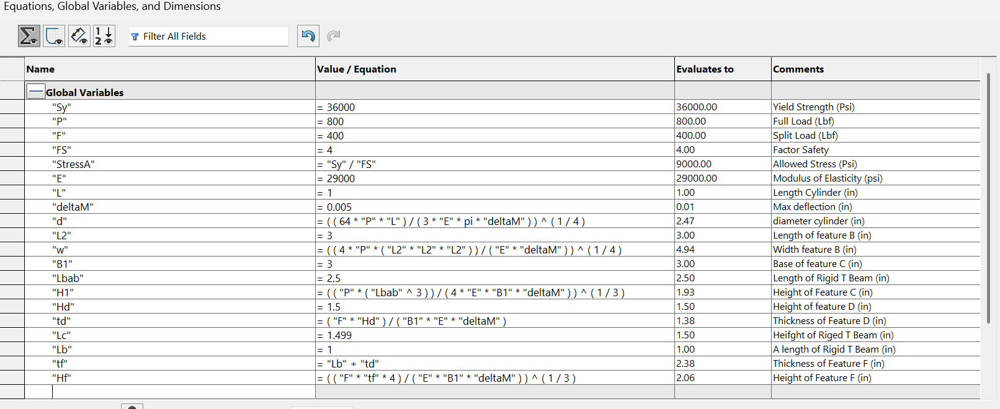

  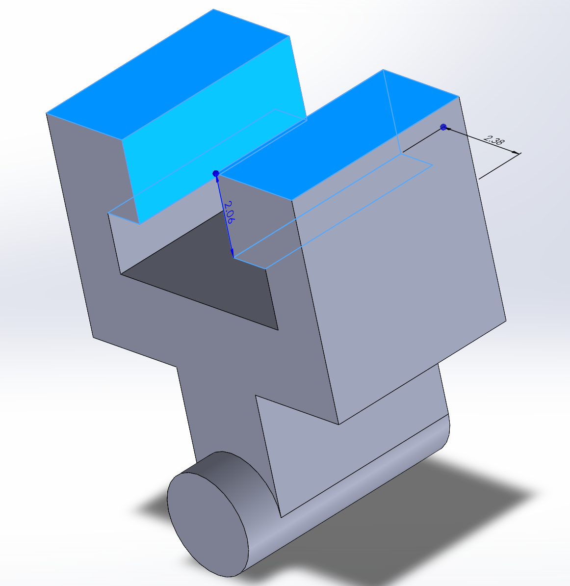

### Final CAD Model

  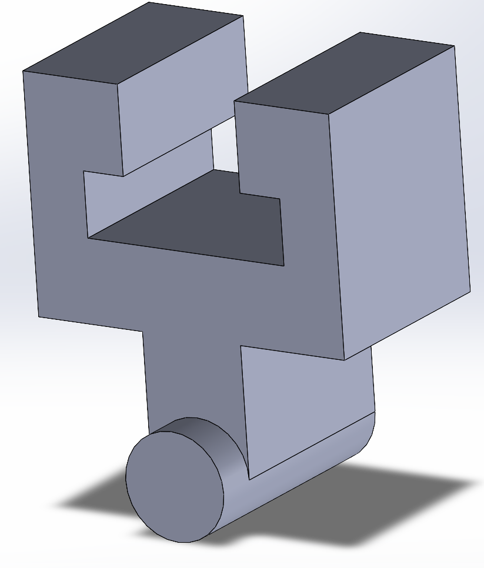

<strong><a href="A6-SeDes.SLDPRT?raw=true">Download SolidWorks Part File</a></strong>

## Engineering Drawing

This section is the start of the engineering sketch. I am using the "A3 (ISO)" option for sketch format.

  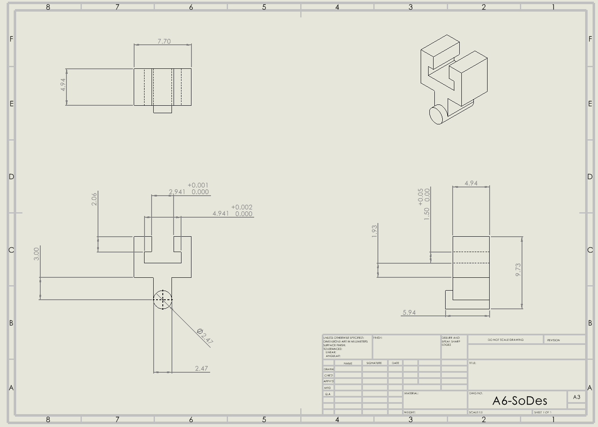

I applied a tighter tolerance to the widths because they were mating surfaces and they would determine how tightly the designed part would hold on. Then I designed a tolerance of only 0.05 to the height of interior of the holding mechanism of the part because if the interior is too small the part will not fit, but any size over the minimum will not prevent the piece from holding on and will save machining costs of the designed part.

<strong><a href="A6-SeDes.SLDDRW?raw=true">Download SolidWorks Drawing File</a></strong>

## Reflection

One analytical equation used to drive an equation was the formula for axial deformation PL/AE. This equation controlled many dimensions such as the height of feature C. I put all of the constant values for the scenario given, such as the modulus of elasticity and yield strength and safety factor. Then I wrote down the algebraic answer I found by hand that solved for the hieght of feature C by rearranging the formula for axial deformation. Next, I wrote that formula into the SolidWorks equation editor. I never had to backtrack and change anything that changed previous formulas, but since I parametrically modelled every dimension I could, any small change to the initial values would greatly change the CAD model and most dimensions.

For the tighter tolerance class, I applied a tolerance of ±.005 to the width dimensions of the mating surfaces, since these surfaces directly interface with the other part and determine how tightly the designed part holds on; any significant deviation here would either prevent a secure fit or make the connection too loose to function reliably, so a tight tolerance was functionally necessary. In contrast, I applied a looser tolerance of ±.05 to the height of the interior of the holding mechanism, since this is a non-critical, clearance-based dimension — the part only needs to be at or above a certain minimum interior size to fit properly, and any size beyond that minimum does not improve or impair function. Holding a non-critical feature like this to an unnecessarily tight tolerance would increase manufacturing cost and difficulty without any functional benefit, since tighter tolerances generally require slower feed rates, more precise (and often more expensive) machining processes, additional inspection, and higher rates of part rejection during quality control — all for a dimension where that level of precision provides no actual improvement to the part's performance.
